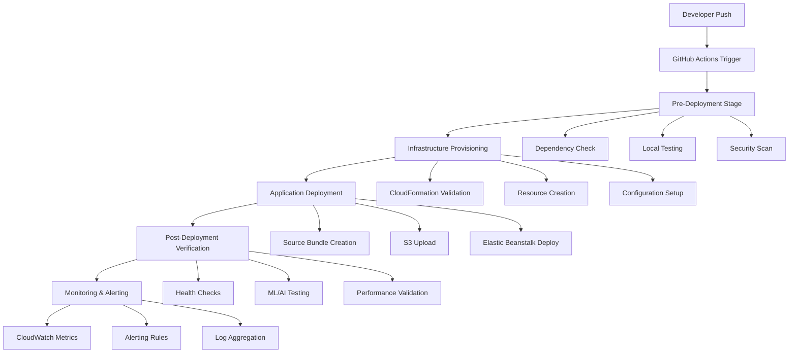

# Design Document

## Overview

This design document outlines a comprehensive CI/CD pipeline for the Passport Photo AI Enhanced Backend. The pipeline implements a multi-stage approach that automates infrastructure provisioning, pre-deployment validation, AWS deployment, and post-deployment verification. The solution leverages GitHub Actions as the orchestration platform, AWS CloudFormation for infrastructure as code, and comprehensive testing strategies to ensure reliable deployments.

The pipeline is designed to handle the complex ML/AI dependencies of the application (OpenCV, rembg, NumPy) while providing robust error handling, security controls, and monitoring capabilities. It follows DevOps best practices including shift-left testing, infrastructure as code, and automated rollback mechanisms.

## Architecture

### High-Level Architecture



### Pipeline Stages

The pipeline consists of five main stages executed sequentially:

1. **Pre-Deployment Validation**: Validates dependencies, runs local tests, and performs security scans
2. **Infrastructure Provisioning**: Creates and configures AWS resources using CloudFormation
3. **Application Deployment**: Builds and deploys the application to Elastic Beanstalk
4. **Post-Deployment Verification**: Runs comprehensive tests against the deployed application
5. **Monitoring Setup**: Configures monitoring, alerting, and observability

### Technology Stack

- **Orchestration**: GitHub Actions with custom workflows
- **Infrastructure**: AWS CloudFormation for infrastructure as code
- **Deployment Target**: AWS Elastic Beanstalk with auto-scaling
- **Storage**: Amazon S3 for deployment artifacts and static assets
- **Database**: Amazon DynamoDB for email validation and analytics
- **Monitoring**: AWS CloudWatch for metrics, logs, and alerting
- **Security**: AWS IAM for access control and AWS Secrets Manager for sensitive data

## Components and Interfaces

### GitHub Actions Workflow

The main workflow file (`.github/workflows/deploy.yml`) orchestrates the entire pipeline:

```yaml
name: CI/CD Pipeline
on:
  push:
    branches: [main, develop]
  pull_request:
    branches: [main]

jobs:
  pre-deployment:
    runs-on: ubuntu-latest
    outputs:
      deployment-ready: ${{ steps.validation.outputs.ready }}
    steps:
      - name: Checkout code
      - name: Validate dependencies
      - name: Run local tests
      - name: Security scan
      
  infrastructure:
    needs: pre-deployment
    if: needs.pre-deployment.outputs.deployment-ready == 'true'
    runs-on: ubuntu-latest
    outputs:
      infrastructure-ready: ${{ steps.provision.outputs.ready }}
    steps:
      - name: Validate CloudFormation
      - name: Deploy infrastructure
      - name: Configure resources
      
  deployment:
    needs: infrastructure
    if: needs.infrastructure.outputs.infrastructure-ready == 'true'
    runs-on: ubuntu-latest
    outputs:
      deployment-url: ${{ steps.deploy.outputs.url }}
    steps:
      - name: Create source bundle
      - name: Deploy to Elastic Beanstalk
      - name: Wait for deployment
      
  post-deployment:
    needs: deployment
    runs-on: ubuntu-latest
    steps:
      - name: Health checks
      - name: ML/AI testing
      - name: Performance validation
```

### Pre-Deployment Validation Component

This component performs comprehensive validation before deployment:

**Dependency Validator**:
- Parses `requirements.txt` and validates all dependencies
- Checks for ML/AI library compatibility (OpenCV, rembg, NumPy versions)
- Verifies Python version compatibility
- Validates package security using safety checks

**Local Test Runner**:
- Starts the Flask application locally
- Runs health endpoint tests
- Processes sample images from `test_images` directory
- Validates CORS configuration
- Tests email validation workflows

**Security Scanner**:
- Scans dependencies for known vulnerabilities
- Validates AWS IAM permissions
- Checks for hardcoded secrets in code
- Validates CloudFormation template security

### Infrastructure Provisioning Component

This component manages AWS resource creation and configuration:

**CloudFormation Manager**:
- Validates template syntax and parameters
- Creates or updates CloudFormation stacks
- Monitors stack creation progress
- Handles rollback on failures

**Resource Configurator**:
- Configures DynamoDB tables with proper indexes
- Sets up S3 buckets with appropriate permissions
- Configures Elastic Beanstalk environments
- Manages IAM roles and policies

### Application Deployment Component

This component handles application packaging and deployment:

**Source Bundle Creator**:
- Packages application files and dependencies
- Creates deployment-ready ZIP archives
- Uploads bundles to S3 deployment bucket
- Manages versioning and cleanup

**Elastic Beanstalk Deployer**:
- Deploys application versions to environments
- Monitors deployment progress
- Configures environment variables
- Handles blue-green deployments for zero downtime

### Post-Deployment Verification Component

This component validates the deployed application:

**Health Check Validator**:
- Tests all API endpoints for availability
- Validates response formats and status codes
- Checks database connectivity
- Verifies external service integrations

**ML/AI Feature Tester**:
- Processes images from `test_images` directory
- Tests face detection with OpenCV
- Validates background removal with rembg
- Checks image enhancement features
- Tests email validation workflows

**Performance Monitor**:
- Measures API response times
- Validates memory and CPU usage
- Tests concurrent request handling
- Monitors error rates and success metrics

## Data Models

### Pipeline Configuration Model

```python
class PipelineConfig:
    environment: str  # dev, staging, prod
    aws_region: str
    instance_type: str
    min_instances: int
    max_instances: int
    deployment_bucket: str
    cloudformation_template: str
    notification_channels: List[str]
    rollback_enabled: bool
    monitoring_enabled: bool
```

### Deployment Metadata Model

```python
class DeploymentMetadata:
    deployment_id: str
    commit_hash: str
    branch: str
    timestamp: datetime
    environment: str
    status: DeploymentStatus
    infrastructure_stack: str
    application_version: str
    deployment_url: str
    test_results: Dict[str, TestResult]
    rollback_version: Optional[str]
```

### Test Result Model

```python
class TestResult:
    test_name: str
    status: TestStatus  # PASSED, FAILED, SKIPPED
    duration: float
    error_message: Optional[str]
    details: Dict[str, Any]
    timestamp: datetime
```

### Infrastructure State Model

```python
class InfrastructureState:
    stack_name: str
    stack_status: str
    resources: List[AWSResource]
    outputs: Dict[str, str]
    parameters: Dict[str, str]
    creation_time: datetime
    last_updated: datetime
```

## Correctness Properties

*A property is a characteristic or behavior that should hold true across all valid executions of a system—essentially, a formal statement about what the system should do. Properties serve as the bridge between human-readable specifications and machine-verifiable correctness guarantees.*

The following correctness properties define the expected behavior of the CI/CD pipeline across all execution scenarios:

### Property 1: Infrastructure Provisioning Consistency
*For any* pipeline execution with valid CloudFormation templates and AWS credentials, the pipeline should successfully create all required AWS resources (DynamoDB tables, S3 buckets, Elastic Beanstalk environments) with proper configuration and rollback any partially created resources on failure.
**Validates: Requirements 1.1, 1.2, 1.3, 1.4, 1.5, 1.6**

### Property 2: Pre-deployment Validation Completeness  
*For any* application codebase with requirements.txt and test_images directory, the pre-deployment validation should verify all dependencies (including ML/AI libraries), run local tests, validate API endpoints, process sample images, verify CORS configuration, and halt deployment with specific error details if any check fails.
**Validates: Requirements 2.1, 2.2, 2.3, 2.4, 2.5, 2.6, 2.7**

### Property 3: Deployment Pipeline Execution
*For any* valid source code and target environment configuration, the deployment process should create source bundles with all required files, upload to S3, deploy to Elastic Beanstalk, configure environment variables, monitor progress, and verify application accessibility upon completion.
**Validates: Requirements 3.1, 3.2, 3.3, 3.4, 3.5, 3.6, 3.7**

### Property 4: Post-deployment Verification Comprehensiveness
*For any* successfully deployed application, the post-deployment verification should wait for full availability, validate all health checks, test ML/AI features with test_images, verify email validation workflows, validate CORS functionality, check performance thresholds, and test face detection and background removal capabilities.
**Validates: Requirements 4.1, 4.2, 4.3, 4.4, 4.5, 4.6, 4.7, 4.8, 4.9**

### Property 5: Configuration Management Flexibility
*For any* environment configuration (dev, staging, prod), the pipeline should support environment-specific settings, allow configuration of deployment parameters, provide rollback mechanisms, and generate detailed execution logs.
**Validates: Requirements 5.1, 5.2, 5.3, 5.4, 5.5, 5.6**

### Property 6: Error Handling and Recovery
*For any* error condition during pipeline execution, the system should capture detailed error information, clean up partially created resources, preserve previous working versions, provide specific failure details with remediation suggestions, handle timeouts gracefully, and implement exponential backoff for transient failures.
**Validates: Requirements 6.1, 6.2, 6.3, 6.4, 6.5, 6.6**

### Property 7: Security Controls Enforcement
*For any* pipeline execution involving sensitive data, the system should access AWS credentials through secure management systems, encrypt all sensitive configuration and secrets, scan deployment artifacts for vulnerabilities, maintain audit trails, follow least privilege principles for IAM permissions, and use encrypted connections for all AWS API calls.
**Validates: Requirements 7.1, 7.2, 7.3, 7.4, 7.5, 7.6**

### Property 8: Monitoring and Observability
*For any* pipeline execution, the system should log all major steps with timestamps and status, track deployment metrics (duration, success rates), configure CloudWatch alarms for deployed applications, measure and report API response times, monitor resource utilization (CPU, memory, storage), and notify stakeholders of critical issues or failures.
**Validates: Requirements 8.1, 8.2, 8.3, 8.4, 8.5, 8.6**

## Error Handling

The pipeline implements comprehensive error handling at multiple levels:

### Stage-Level Error Handling
- Each pipeline stage validates its prerequisites before execution
- Failed stages trigger automatic cleanup of resources created in that stage
- Error context is preserved and propagated to subsequent error handling logic
- Rollback mechanisms are triggered based on the failure point

### Infrastructure Error Handling
- CloudFormation stack failures trigger automatic rollback
- Partial resource creation is detected and cleaned up
- Resource dependency failures are handled with proper ordering
- AWS service limits and quotas are validated before resource creation

### Application Error Handling  
- Deployment failures preserve the previous working version
- Health check failures trigger automatic rollback procedures
- Performance threshold violations generate alerts and optional rollback
- ML/AI feature test failures provide detailed diagnostic information

### Security Error Handling
- Credential access failures halt pipeline execution immediately
- Security scan failures prevent deployment progression
- IAM permission errors provide specific remediation guidance
- Audit log failures trigger administrative alerts

## Testing Strategy

The CI/CD pipeline testing strategy employs both unit testing and property-based testing to ensure comprehensive coverage:

### Unit Testing Approach
Unit tests focus on specific pipeline components and scenarios:
- **Configuration Validation**: Test specific CloudFormation templates and parameter combinations
- **Error Scenarios**: Test specific failure conditions and recovery mechanisms  
- **Integration Points**: Test AWS service integrations with mocked responses
- **Security Controls**: Test specific security validation rules and access patterns

### Property-Based Testing Approach
Property-based tests validate universal behaviors across all inputs using **pytest-hypothesis** as the testing framework:
- **Minimum 100 iterations** per property test to ensure comprehensive input coverage
- Each property test references its corresponding design document property
- **Tag format**: `# Feature: ci-cd-pipeline, Property {number}: {property_text}`

### Test Configuration
- Property tests run with minimum 100 iterations due to randomization
- Tests generate random pipeline configurations, AWS resource parameters, and application states
- Edge cases are handled through intelligent test data generation
- Both unit and property tests are required for comprehensive pipeline validation

### Test Data Management
- Sample applications with varying dependency configurations
- Test image sets covering different ML/AI processing scenarios  
- CloudFormation templates with different resource combinations
- Environment configurations for dev, staging, and production scenarios

The dual testing approach ensures that specific edge cases are caught by unit tests while universal correctness properties are validated across all possible pipeline executions through property-based testing.
